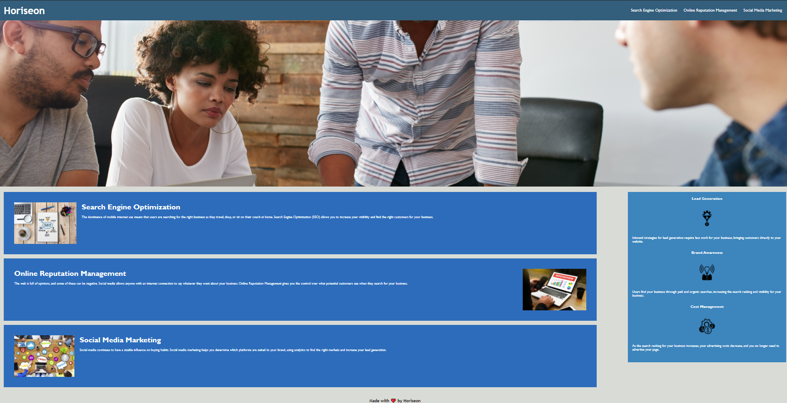

README - Code Refactor Challenge.

Project Description:

The purpose of this project was to alter an existing website so that it would meet accessibility and search engine optimization standards.

List of edits made:
    -Fixed broken SEO link.
    -Consolidated colors used in the CSS stylesheet into a single root element.
    -Added descriptive site title.
    -Added semantic HTML elements.
    -Consolidated several duplicate CSS style elements.
    -Fixed the "Horiseon" h1 element to make it more readable in the index.html file.
    -Added alt text to image hrefs.
    -Moved index.html to root directory.
    -Added a descriptive README file.
    -Added comments to CSS style elements to explain their purpose.
    -Within the style.css file - Moved style elements for the "main" section of the page so that they would appear before elements for the "aside" section of the page.
    This improves readability, and ensures that the style elements correspond with the html elements in the index file.

Files in this project:
>assets
    *css
        -style.css
    *images
        -brand-awareness.png
        -cost-management.png
        -digital-marketing-meeting.png
        -lead-generation.png
        -online-reputation-management.png
        -search-engine-optimization.png
        -social-media-marketing.png
        -screenshot.png
>.gitignore
>README.md
>index.html

Screenshot of application:

